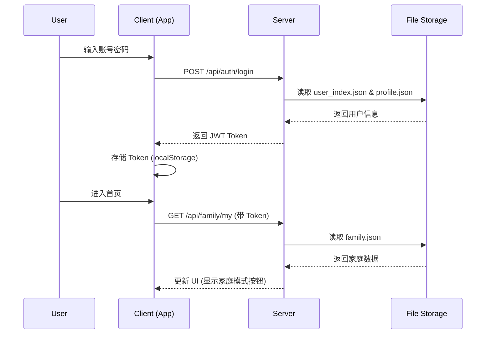
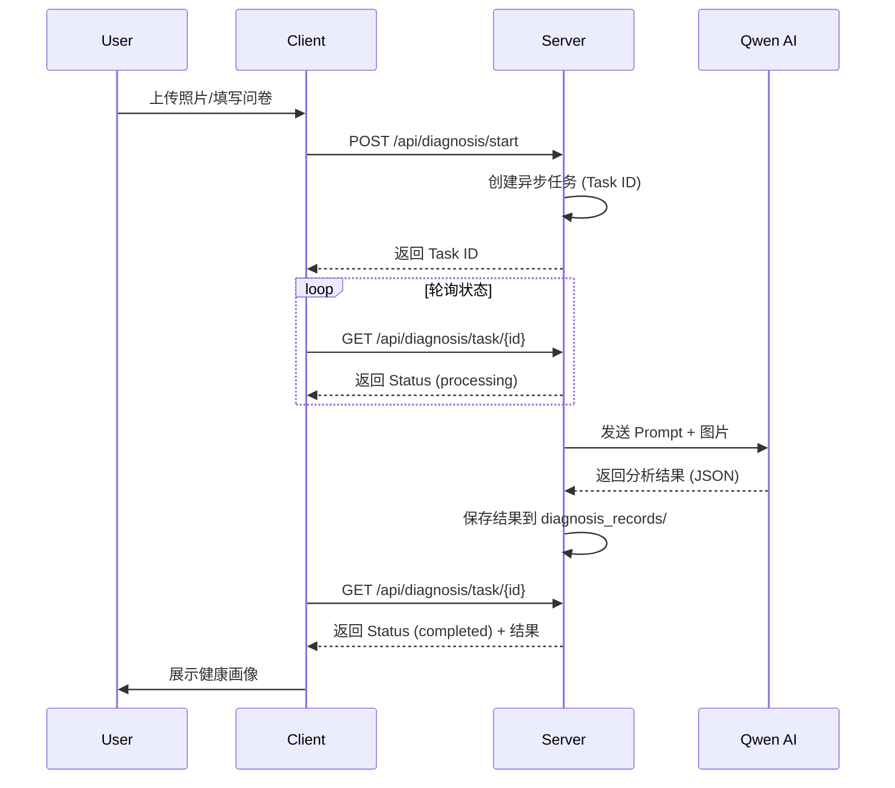
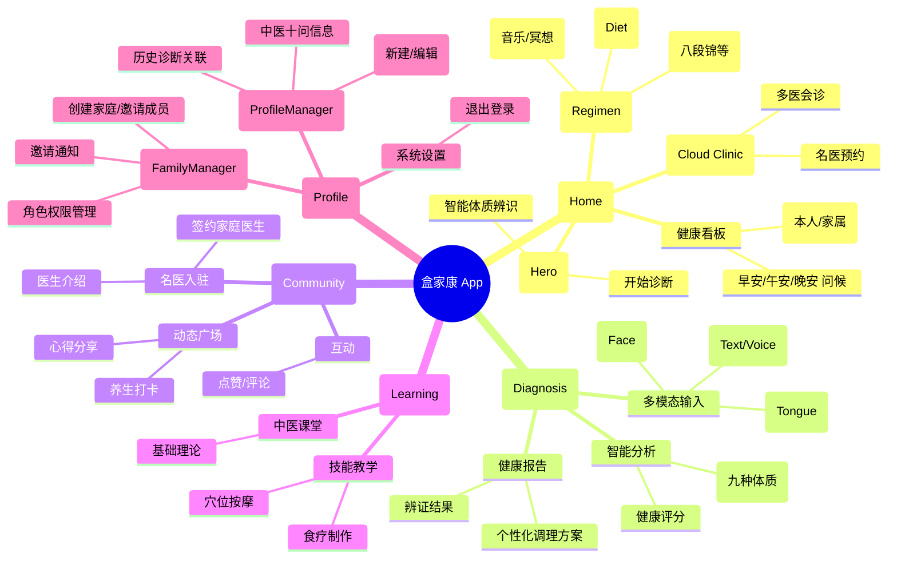

# 盒家康 (HaloCare) 软件架构文档

## 1. 架构概览 (System Overview)

盒家康采用典型的 **Client-Server (C/S)** 架构，前端基于 React 构建单页应用 (SPA)，并通过 Capacitor 封装为 Android 应用；后端使用 Node.js (Express) 提供 API 服务与数据持久化，同时集成阿里云 Qwen 大模型提供 AI 核心能力。

```mermaid
graph TD
    %% Client Layer
    subgraph Client [客户端 (Web / Android)]
        UI[React UI Components]
        Router[Layout & Routing]
        State[React State / Context]
        Service[API Service (api.ts)]
        
        UI --> Router
        Router --> State
        State --> Service
    end

    %% Server Layer
    subgraph Server [服务端 (Node.js + Express)]
        API[API Gateway (Express)]
        Auth[JWT Authentication]
        TaskManager[Async Task Manager]
        DB_Adapter[DB Adapter (db.js)]
        
        API --> Auth
        API --> TaskManager
        API --> DB_Adapter
    end

    %% Data Layer
    subgraph Data [数据存储 (File System)]
        UserStore[Users (JSON)]
        FamilyStore[Families (JSON)]
        RecordStore[Health Records (JSON)]
        FileStore[Uploads (Images)]
        
        DB_Adapter --> UserStore
        DB_Adapter --> FamilyStore
        DB_Adapter --> RecordStore
        DB_Adapter --> FileStore
    end

    %% External Services
    subgraph External [外部服务]
        Qwen[阿里云 Qwen-VL (AI 诊断)]
    end

    %% Connections
    Service -- HTTP/HTTPS --> API
    TaskManager -- API Call --> Qwen
    Client -- Capacitor Bridge --> Hardware[手机硬件 (Camera/Mic)]
```

---

## 2. 核心模块详解 (Core Modules)

### 2.1 前端架构 (Frontend)
- **技术栈**: React 19, TypeScript, Vite, Tailwind CSS
- **核心组件**:
  - `Layout`: 负责响应式布局（桌面端侧边栏 / 移动端底栏）与页面转场动画。
  - `ProfileManager`: 健康档案管理（CRUD），包含“十问”表单与历史记录关联。
  - `FamilyManager`: 家庭组管理，处理邀请、权限与通知。
  - `ARDiagnosis`: AI 望闻问切核心交互界面。
- **服务层 (`services/api.ts`)**: 统一封装 Axios/Fetch 请求，处理 Token 认证与错误拦截。

### 2.2 后端架构 (Backend)
- **技术栈**: Node.js, Express
- **API 设计**: RESTful 风格
  - `/api/auth`: 用户认证 (JWT)
  - `/api/family`: 家庭组逻辑
  - `/api/profiles`: 健康档案管理
  - `/api/diagnosis`: AI 诊断任务调度
- **任务调度 (`taskManager.js`)**:
  - 处理耗时的 AI 推理请求。
  - 维护任务队列与状态 (Pending -> Processing -> Completed)。

### 2.3 数据存储 (Data Persistence)
- **方案**: 基于文件系统的 JSON NoSQL 存储 (`server/storage/`)
- **优势**: 部署简单，数据迁移方便 (直接打包文件夹)，适合中小规模应用。
- **结构**:
  - `users/`: 存储用户 Profile、设置、通知。
  - `users/[id]/health_profiles/`: 独立的健康档案文件。
  - `users/[id]/diagnosis_records/`: AI 诊断历史记录。
  - `families/`: 家庭组关系数据。

### 2.4 AI 集成 (AI Integration)
- **模型**: Alibaba Cloud Qwen-Plus (文本) / Qwen-VL-Max (多模态)
- **流程**:
  1. 用户上传面部/舌苔照片或输入症状。
  2. 后端 TaskManager 接收请求。
  3. 调用 DashScope API 进行多模态分析。
  4. 返回结构化的中医体质辨识报告 (Constitution, Diet, Schedule)。

---

## 3. 数据流向 (Data Flow)

### 3.1 用户登录与数据同步


### 3.2 AI 辅助诊断流程


---

## 4. 逻辑架构图 (Logical Architecture / Feature Map)

以下脑图展示了盒家康系统的功能模块划分与层级结构：


